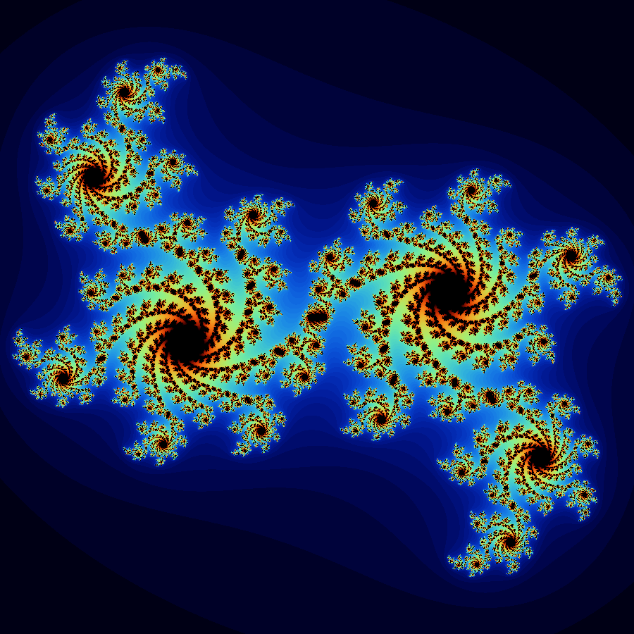

# julia-set-generator

Simple *.ppm* julia-set generator written in C.

Julia set is a fractal in complex plane, which represents a set where all its elements in sequence `z(n) = z(n-1)^2 + c` does not diverge.

## Installation

1. `make bin`
2. `./generator ITERATIONS ZOOM_X ZOOM_Y C_X C_Y COLOR `
    - Example: `./generator 100 1.2 1.2 0.34 -0.4 1`

## Output

